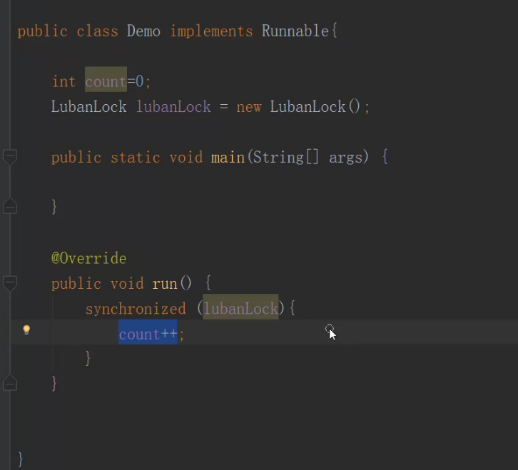
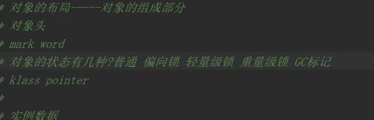

## 并发原理之synchronized底层之对象布局

1. 第一个线程去访问堆里的这个锁对象,这个锁有个状态,拿到之后进行改变,那么第二个线程来的时候看到这个对象的状态改变的时候就不会继续使用这个对象了
2. 对象的布局  JVM对对象做的规定,对象头 实例数据 对齐填充
3. jvm HotSpot  
4. openJdk 包含jdk jvm  官方开源项目
5. jol-core 依赖
6. 以8的整数倍的字节进行字节对齐(数据对齐)

##### 对象头是什么?

包含两个词 一个markword 一个klass pointer

