## 缓存四大问题

### 怎么来使用缓存

1. 查询缓存,查询redis
2. 命中缓存,正常返回
3. 没有查到就去数据库中

### 缓存穿透

1. 查询不存在的数据,去查询了数据库,这就是缓存穿透
2. 查询一条缓存没有这条数据,数据库中也米有

##### 缓存空对象

1. 把空对象的查询也加入缓存
2. 同时要判断查询缓存是不是一个空对象
3. 代码简单,效果一般,而且redis会存在大量的空对象,占用空间

##### 布隆过滤器

**代码维护相当复杂,效果很好**

###### 应用

```
guava依赖
```

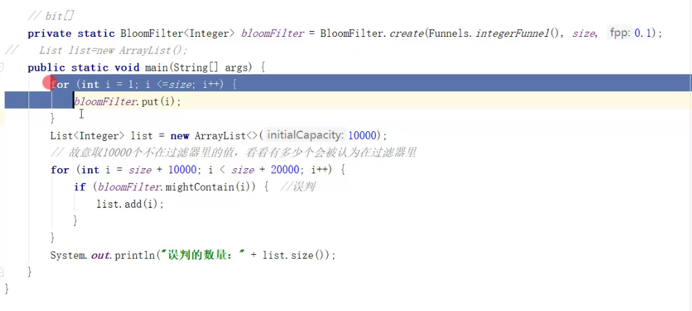

布隆:会出现误判,是一个集合对象

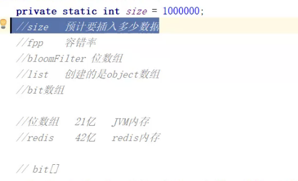

###### 原理  

8bit 一位 底层bit数组 位数组

1. 3个hash函数进行运算key
2. hash函数的作用:专门对某一个数据进行hash,最终得到一个数字,相同的数据得到的数字是一样的
3. hash之后的数字对数组长度取余，保证数组不越界
4. 误判原因:hash碰撞
5. 容错率:数组长度和哈希函数的个数
6. 通过预计插入量和容错率算出数组长度和哈希函数的个数
7. 容错率越低,性能开销就越大,开辟的内存是在JVM内存中的
8. 位数组长度 最多21亿  jvm数据不会进行持久化
9. 但是redis可以持久化

###### 查询redis的位数组

```sql
set taibai键 abc值  #保存abc 转成二进制 用位数组来保存  可以通过位数来获得
toBinary();
```

###### bitmaps

本质是String,是一串连续的2进制数字

string最大长度是512M  可以是42亿位

setbit taibai 1000 1将第1000位的值改为1,有扩容机制

setbit b 7 1 

setbit key 10000 0 数组长度10000 值为0


##### 手写分布式过滤器 

###### 代码

1. filter类  有预计插入量  容错率  数组长度 和 hash函数个数 以及初始化的计算数组长度 hash个数的方法

2. 根据key获取bitmap的下标

   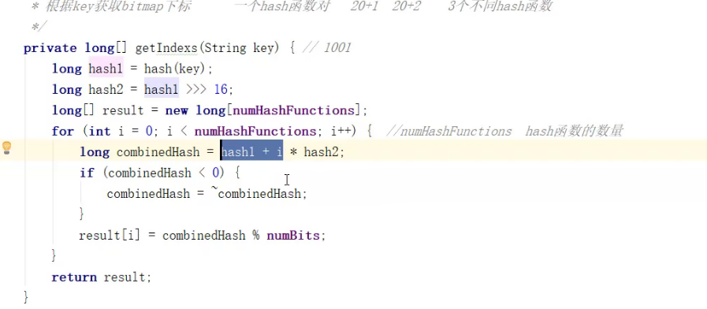

3. put方法

   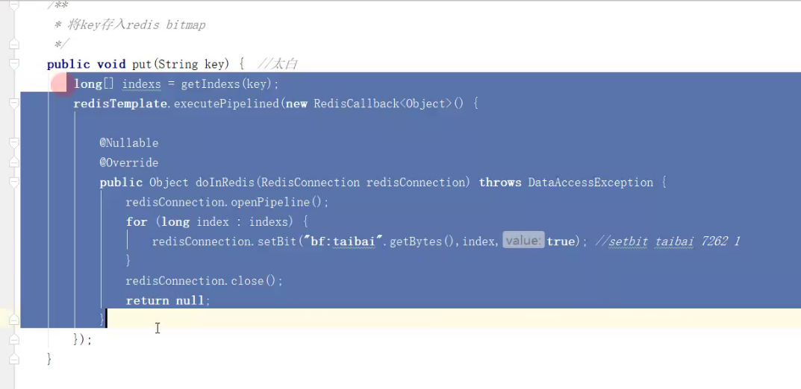

4. 判断是否存在

   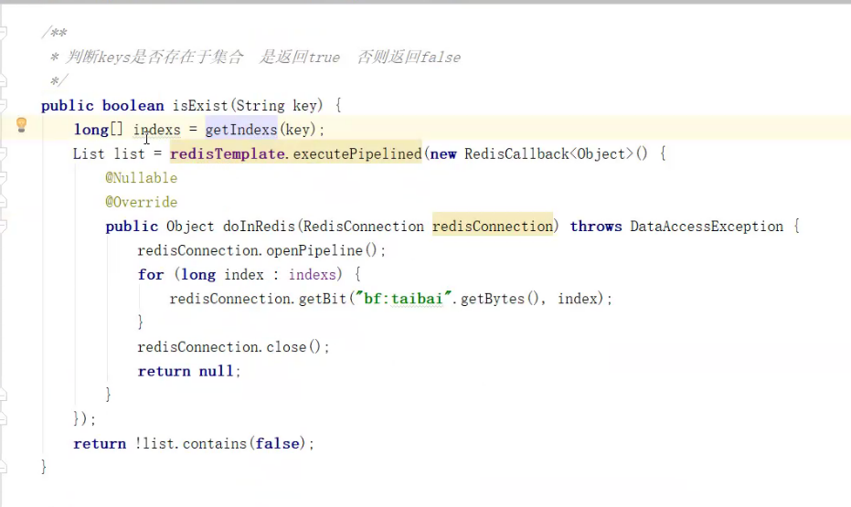

5. 在项目启动的时候,会把表中的id字段全部添加到布隆过滤器当中,如果有人来访问,我们首先判断数字是否存在布隆过滤器中

6. 只能添加不能删除,因为存在哈希冲突

7. 定时重建布隆过滤器

8. 布隆过滤器主要是为了拦截绝对不存在的数据，不知道理解的对不对

9. 先添加布隆数据库再添加数据库

###### 利用手写的解决缓存穿透问题

### 缓存击穿

##### 原理

并发查询一条缓存没有的数据,数据库中有的数据

如果缓存失效,然后有并发请求的话,都会去请求数据库,导致数据库崩溃

##### 并发问题 加锁

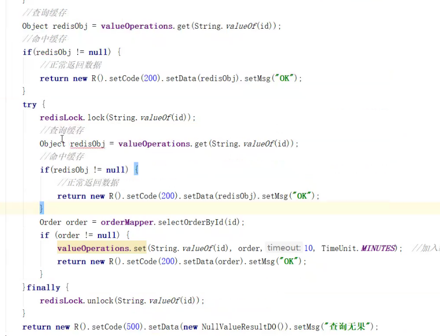

### 缓存雪崩

##### 原理

数据库宕机        大部分数据失效

搭建高可以集群   rediscluster

##### 解决方法

设置失效时间错开

熔断  效率  

### 数据一致性问题

##### 原理

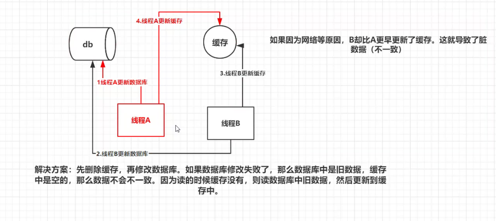

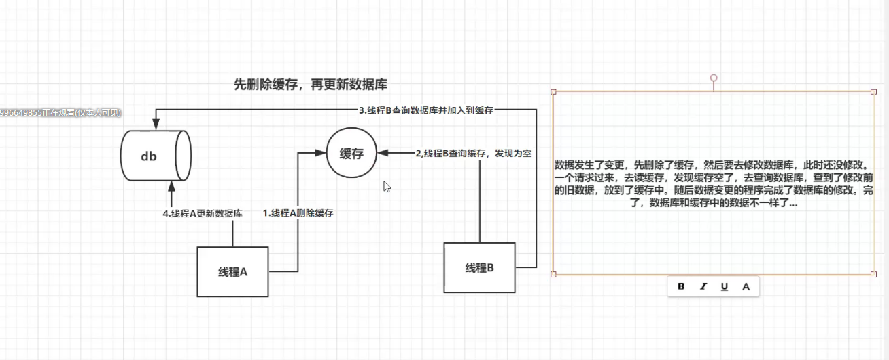

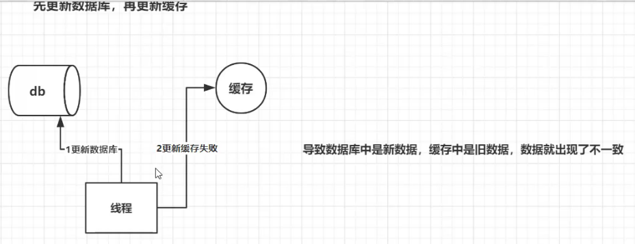

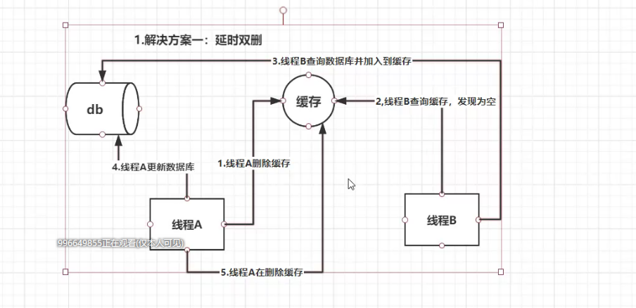

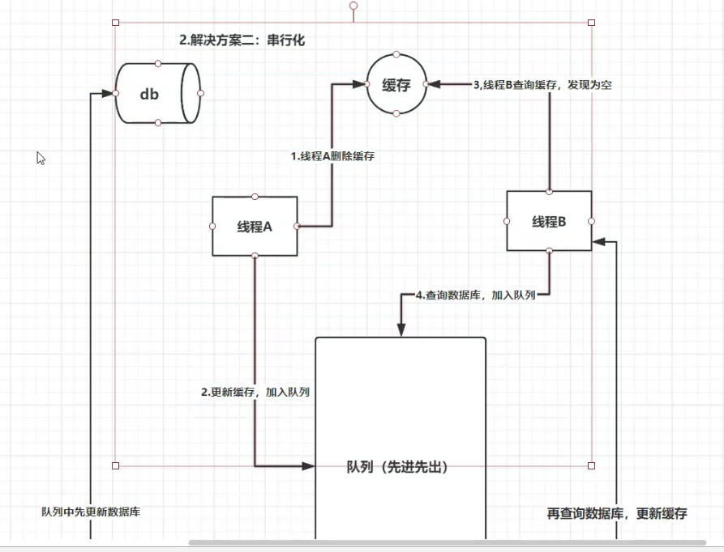